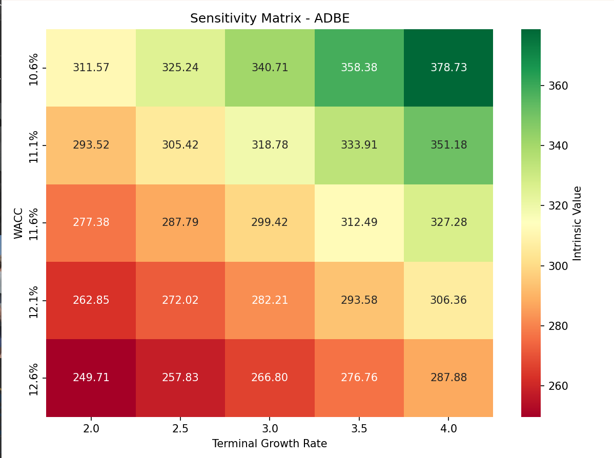
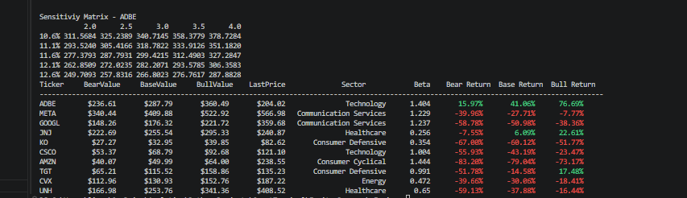

# Equity Research Engine & DCF Model (Python)
Multi-stage Discounted Cash Flow (DCF) valuation platform built in Python for equity research, forecasting, and intrinsic value analysis.

Overview

This project automates the process of analyzing historical financial statements, forecasting future operating performance, and estimating intrinsic value through a discounted cash flow model.

The model integrates Income Statement, Balance Sheet, and Cash Flow Statement data to forecast Unlevered Free Cash Flow to the Firm (UFCF), calculate WACC, estimate Terminal Value, and derive an intrinsic value per share.

Key Features:
 
Historical Financial Analysis,
Revenue growth analysis,
Margin trend analysis,
Working capital analysis,
Capital expenditure analysis,
Forecasting Engine,
Revenue growth forecasting,
Growth decay methodology,
Margin convergence assumptions,
Operating leverage analysis,
Valuation Engine,
FCFF projections,
WACC calculation,
Terminal value estimation,
Enterprise value calculation,
Equity value calculation,
Intrinsic value per share

Example companies analyzed:

Adobe (ADBE),
Meta Platforms (META),
Amazon (AMZN),
Johnson & Johnson (JNJ)

Tech Stack:
 
Python
Pandas
NumPy
OpenPyXL
Financial Modeling Prep API
Example Output

 

Roadmap
Completed
Historical statement integration,
Revenue forecasting framework,
Cost Schedule for COGS & SG&A using Operating Leverage Model,
UFCF forecasting,
WACC calculation,
WallStreet Revenue Estimates,
Terminal value calculation,
Sensitivity Analysis,
In Progress
Margin convergence modeling
Planned
Monte Carlo simulation,
Comparable company valuation,
Automated stock screener integration,
Disclaimer,

This project is intended for educational and research purposes only and should not be considered investment advice.
