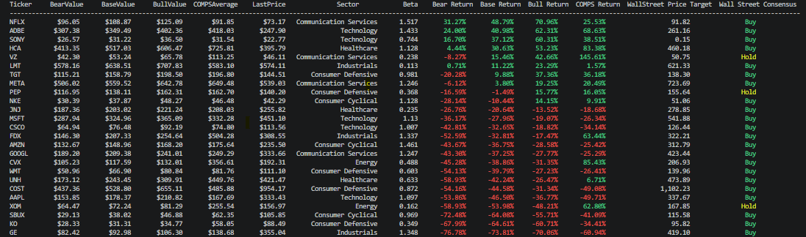
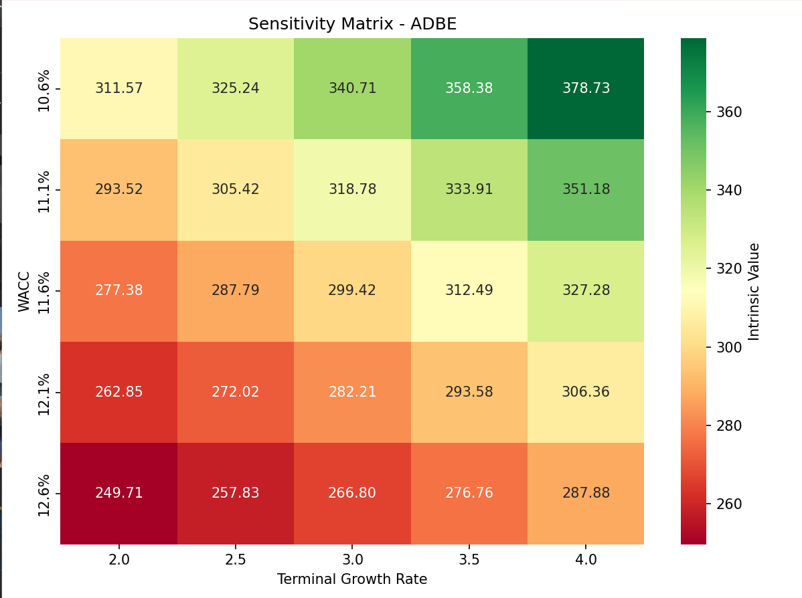

# Python Equity Research & Portfolio Construction Engine
A Python-based equity research engine that automates stock screening, financial forecasting, intrinsic valuation, and portfolio construction.

## Overview

This project automates the equity research process by collecting financial data, forecasting company performance, estimating intrinsic value, and building investment portfolios.

It combines historical financial statements, analyst estimates, discounted cash flow (DCF) valuation, comparable company analysis, scenario analysis, and validation checks to evaluate stocks and identify potential investment opportunities.

## Workflow

### 1. Data Collection
- Automated financial statement collection
- Analyst revenue estimates
- Market and valuation data
- Comparable company identification

### 2. Financial Analysis
- Historical revenue and margin analysis
- Working capital analysis
- Capital expenditure analysis
- Financial ratio analysis

### 3. Sanity Checks
- Missing financial data detection
- Unsupported industry filtering
- Financial statement validation
- Tax rate validation
- Revenue and margin consistency checks

### 4. Forecasting 
- Analyst estimate integration
- Revenue growth forecasting
- Growth decay methodology
- Margin convergence assumptions
- Operating leverage analysis
- Data quality validation

### 5. Valuation
- Multi-stage Discounted Cash Flow (DCF)
- Perpetuity Growth Method
- Exit Multiple Method
- Comparable Company Analysis (Comps)
- Sensitivity & Scenario Analysis

### 6. Validation
- Valuation assumption checks
- Margin validation
- Terminal value validation
- Sector multiple validation
- Intrinsic value comparison

### 7. Portfolio Construction
- Stock screening and ranking
- Mean-Variance Optimization (Modern Portfolio Theory)
- Efficient Frontier portfolio construction

### 8. Portfolio Analytics
- Export selected companies to the [Portfolio Analytics Tracker](https://github.com/liammeyers03-art/portfolio-analytics-tracker.git)
- Track portfolio performance and risk metrics
- Monitor allocation and position sizing
- Benchmark performance against SPY

## Tech Stack
- Pandas
- NumPy
- yfinance
- matplotlib
- seaborn
- Financial Modeling Prep API
- Microsoft Excel

  

## Example Research Output

 

## Sensitivity Analysis 

